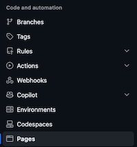

# Oliviax727's Website Template

A GitHub pages template repository, under my own styling and programming implementation, for anyone to use.

https://oliviax727.github.io/ohrw-website-template/

## Setup

After forking the repository, go to **Settings** > **Code and Automation** > **Pages**



Under “Build and Deployment” select “Deploy From Branch” and under “Branch” select the `main` branch. Then, press the save button. Give GitHub a few minutes to deploy, and then access the website via https://[your username].github.io/[your repository name]/ or https://[your username].github.io if the repository is called “[your username].github.io”.

Next, clone your new repository on your local device, and in the terminal, `cd` into the repository and run:

```
npm install
chmod +x src/scripts/cmd/*
```

If you are using VS Code as your preferred IDE, you can install the ESLint extension to start checking files. After editing any files found in `src/scripts/ts` or `entry.js`, make sure to run:

```
./src/scripts/cmd/compile-app.sh
```

## Project Structure

For the directories and files listed in code blocks below:
<table>
    <tr>
        <th>Symbol</th>
        <th>Reccomended Treatment (Directories)</th>
        <th>Reccomended Treatment  (Files)</th>
    </tr>
    <tr>
        <th>🟢</th>
        <th>Modify and Customise</th>
        <th>"</th>
    </tr>
    <tr>
        <th>⚪️</th>
        <th>No reccomended or encouraged actions</th>
        <th>"</th>
    </tr>
    <tr>
        <th>🟡</th>
        <th>Add and edit new custom files to directory</th>
        <th>Avoid modifying unless you want additional customisation</th>
    </tr>
    <tr>
        <th>🟠</th>
        <th>Avoid modifying or adding to unless neccesary</th>
        <th>"</th>
    </tr>
    <tr>
        <th>🔴</th>
        <th>Avoid modification or addition whatsoever</th>
        <th>"</th>
    </tr>
</table>

### Directories

The directory structure looks given as below — in brackets next to each directory is an explanation of what that directory is for.

```
.
└── src ⚪️
    ├── css (CSS style files) 🟡
    ├── data (XML and JSON data) ⚪️
    ├── html (HTML files corresponding to section contents) 🟢
    ├── img ⚪️
    │   ├── assets (General images) 🟢
    │   ├── favicons (Icons used in the page title) 🟢
    │   └── icons (Button icons) 🟡
    ├── layout (Generic, template, and special-use HTML files) 🟡
    └── scripts (Program scripts) 🟡
        ├── app (Compiled Javascript node.js modules) 🔴
        ├── cmd (Bash scripts for automation) 🟡
        ├── dist (Output of typescript compiler) 🔴
        ├── lib (Javascript client-side modules) 🟡
        ├── ts (Typescript node.js modules) 🟢
        └── types (Typescript type declarations) 🔴
```

### Files

Below is the list of top-level files — in brackets next to each file is an explanation of what that file is for.

```
.
├── _config.yml (Github Pages YAML configuration) 🟡
├── 404.html (404 Page) 🟠
├── babel.config.json (Babelify configuration) 🟠
├── bundle.js (Node.js module entry point) 🔴
├── eslint.config.ts (ESLint linting rules) 🟡
├── index.html (HTML entry point) 🟠
├── index.js (Client-side module entry point) 🟢
├── LICENSE 🔴
├── node_modules 🔴
├── notes.txt (Personal Notes) 🟢
├── package-lock.json 🔴
├── package.json 🟢
├── README.md 🟢
├── robots.txt (Communicate with web scrapers) ⚪️
├── style.css (Main styling configuration) 🟠
└── tsconfig.json (Typescript compilation settings) 🟠
```

## Features

Lorem ipsum dolor sit amet.

### Ages and Dates

Lorem ipsum dolor sit amet.

### Ages and Dates

Lorem ipsum dolor sit amet.

## Development

Lorem ipsum dolor sit amet.

### Ages and Dates

Lorem ipsum dolor sit amet.