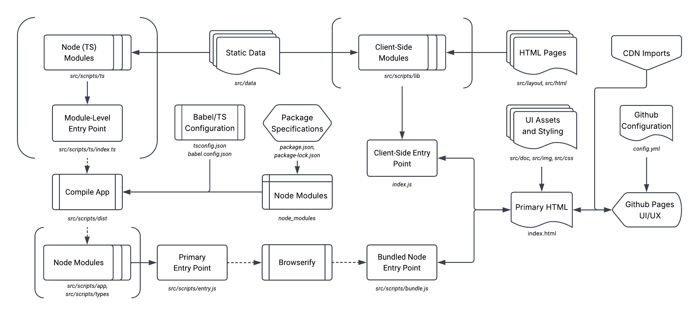

## Code Development

This section covers the aspects of the project that involve implementing additional functionality to the website template via code. Below is a flowchart diagram displaying the entire development, structure, and call sequence of the template repository:



### Frontend Modules

Client-side and/or frontend modules are found in the `src/scripts/lib` directory. All files are written in javascript with ESLint configured to recognise it as an HTML-integrated script with browser global typing.

These modules are generally trivial to develop, as they do not require additional compilation or configuration. As long as any desired classes from these files are imported in `index.js` the files will be integrated into the website's source script. 

It is important to recognise that classes and objects defined in `src/scripts/lib` or `index.js` will not be available to the HTML pages by default, they must be set as a custom field in the `window` or `document` object. For example:

```javascript
import { MyClass, myFunction } from 'src/scripts/lib/my_modules.js';

window.MyClass = MyClass;

window.onload = myFunction();
```

### Backend Structure

The `src/scripts/ts` directory is the main container for all backend modules. The typescript modules (non-strictly written as `<module name>-module[s].ts`) are written in a functional and type-safe manner. These typescript modules are collectively imported together into a single `index.ts`, which defines any IO-style functionality including catching any errors, logging any outputs, and using the modules to execute website functionality. From this, `entry.js` imports from `index.ts` and executes the required functionality, marrying the backend node components with the frontend web components.

What this means in more simple terms is the following:
- No code is executed in any typescript file whatsoever;
- - typescript files only export the required functionality
- - Owing to its name `entry.js` is the entry point for all node module/backend execution
- All typescript files excluding `index.ts` contain exports that are as functionally pure and type-safe as possible
- All interaction with HTML elements/Browser-related types are handled in `entry.js`

This template repository is also set up to add additional directories within `src/scripts` containing separate typescript modules, as long as they follow the same structural rules as above, and directories are not named: `app`, `lib`, `dist`, `ts`, `cmd`, and `types`.

Once a section of the code has been implemented, or is ready to compile, run the command `./src/scripts/cmd/compile-app.sh` in a shell terminal to bundle all node-reliant code into a browser-friendly `bundle.js` file that the website itself can use.

### Configuring the Backend

NPM packages can be installed from the default configuration using `npm i`. If additional packages are needed simply install `npm i -D <module>` for developer-only packages and `npm i <module>` for code-necessary packages. Always import modules using ESNext syntax instead of CommonJS.

The backend modules are written in Typescript and use node's global reference types instead of browser typing. These modules employ significantly stricter linter settings to encourage type safety and functional purity.

If desired, different ESLint modules can be imported and used, however I do recommend keeping a few things consistent:
- Maintaining a separation between browser-only modules (always written in javascript) and node-only modules (always written in Typescript)
- Using ESLint's type checking and javascript integration
- Keeping the `@html-eslint/eslint-plugin` for javascript client-side modules
- Keeping `eslint-plugin-functional` for typescript node modules, to encourage functional programming

I have not integrated JSDoc/TSDoc into this project because I personally don't want to figure out how to implement it. But if you want to contribute to this repository and make it work, then let me know. Otherwise, implement at your own choice.

### Command-Line Interface

Within the `src/scripts/cmd` directory you can find bash scripts for automating parts of the development process. The most important script is `compile-app.sh`, which will automatically convert node modules into a resulting bundled and browser-friendly javascript file.

The other two files `propagate-html.sh` and `update-from-upstream.sh` are very simple:
- The first will simply take the data in `src/layouts/content-template.html` and copy it over into each HTML file in `src/html` excluding the designated homepage. This has limited usefulness in the early stages of development so that it prevents repeated copying-and-pasting
- The second will forcefully overwrite any changes by pulling from the existing state in the upstream directory. This is used in my case to maintain consistency between this template repository and my two website repositories. But it probably should be modified to not overwrite new changes.

### Miscellaneous

Other configurations to the GitHub pages can be made with the `config.yml`. Jekyll also has other functionality available including a custom RSS/Atom feed that logs repository updates, but it requires ruby.

Feel free to modify `robots.txt`. Currently, it disallows everything except Google and DuckDuckGo search engine web scrapers.

CDNs should be imported from within the `index.html` metadata header. Use CDNs sparingly unless specific HTML functionality is needed. Currently, only `zero-md` and `modern-normalize` are imported for inter-browser consistency and markdown integration.

All other UI assets should be stored in `src/doc` and `src/img`.
